# Lab 03 - Criação de Bucket no S3

### 1. Criação de Bucket
1.1. No painel inicial, ir até o serviço do S3.

1.2. Clique em "Create Bucket".

1.3. Escolha o bucket do tipo **General purpose** e defina um nome para o bucket e a região em que ele deve ficar. O nome do bucket deve ser único em toda a AWS, não só na sua conta.

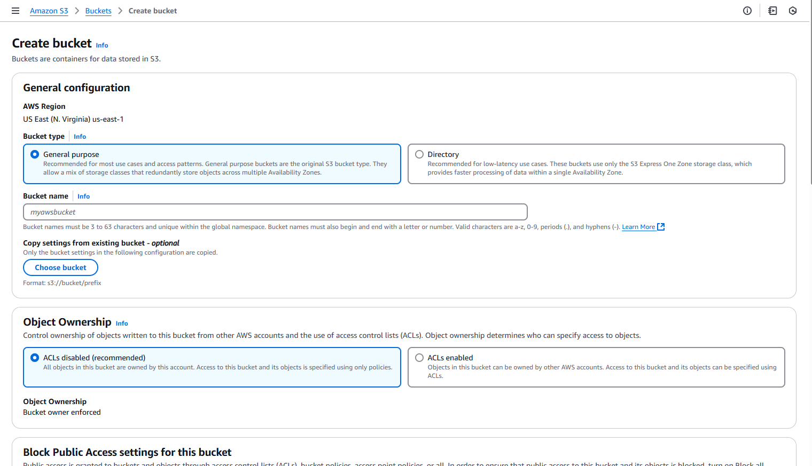

1.4. Existe a opção de copiar as configurações de outro bucket já existente. Como estamos criando um bucket padrão, deixe isso em branco.

1.5. Nas opções abaixo, pode-se configurar a propriedade dos objetivos (ACL), o bloqueio de acesso público, o versionamento, tags e criptografia do bucket. Para este lab, não faremos essas configurações.

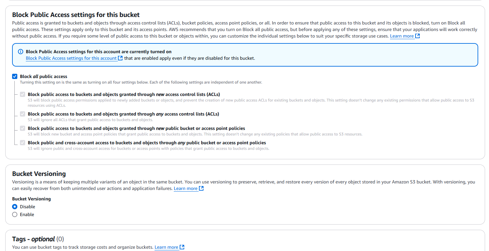

1.6. Nessas opções é onde se configura as permissões de acesso ao bucket e seus objetos. Por padrão o acesso público ao bucket e seus objetos é bloqueado e é extremamente recomendado que se mantenha dessa forma.

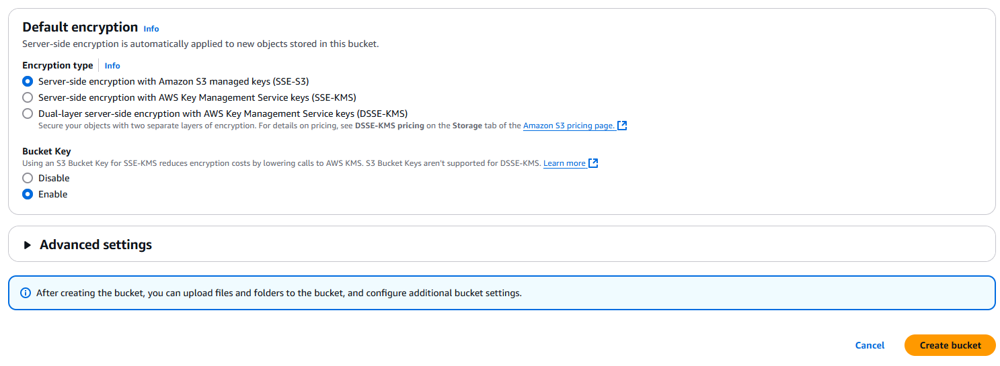

1.7. Revise as configurações e clique em **Create Bucket**. Na próxima tela, poderemos ver o bucket criado.

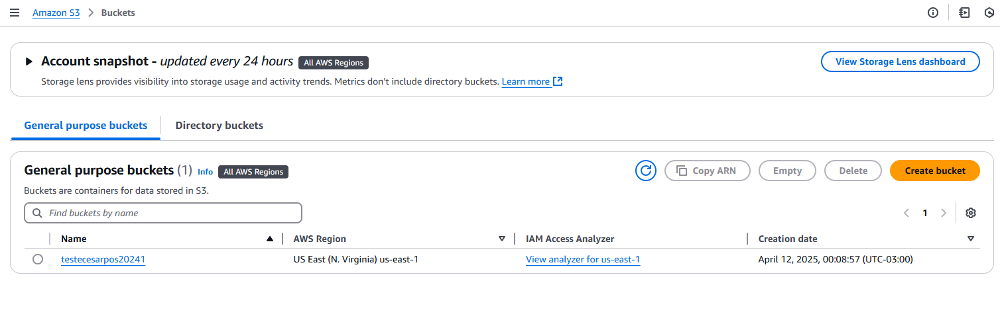

### 2. Upload de Objeto

2.1. Clique no bucket para abrir e fazer upload de arquivos. Clique em **Upload** para fazer upload de objetos.

2.2. Clique em **Add File** e escolha o objeto ou objetos que deseja subir para o bucket.

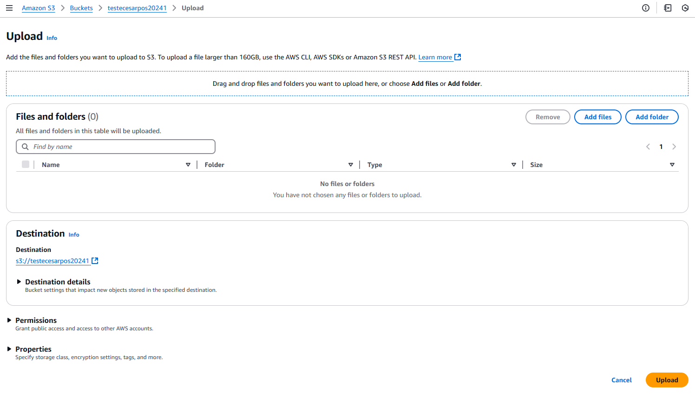

2.3. Na seção **Permissions** podemos configurar os acessos permitidos ao objeto. Como mantivemos as ACLs desabilitadas, os objetos serão de propriedade da conta AWS cujo bucket pertence.

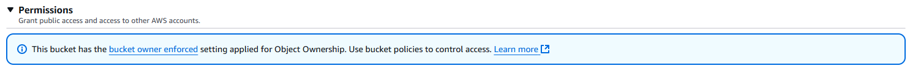

2.4. Na seção **Properties** é possível escolher em qual classe do S3 o objeto vai ser armazenado, além de configurações de criptografia e tags. Mantenha no *Standard*, que é o padrão.

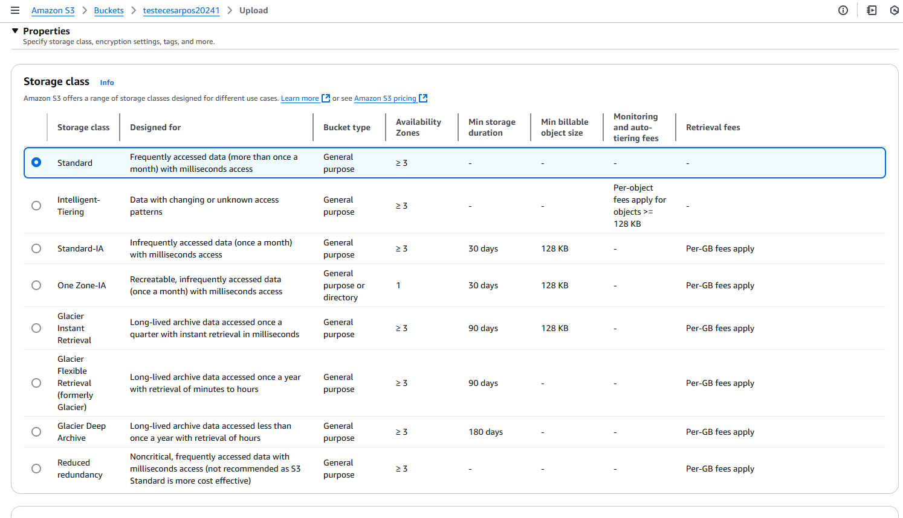

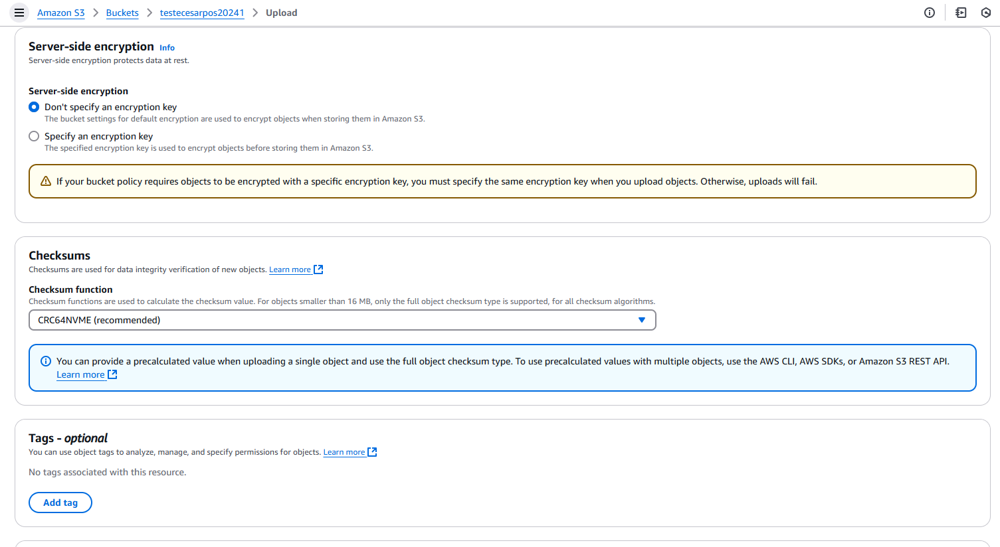

2.5. No final, clique em **Upload** e uma janela com o envio do arquivo aparecerá.

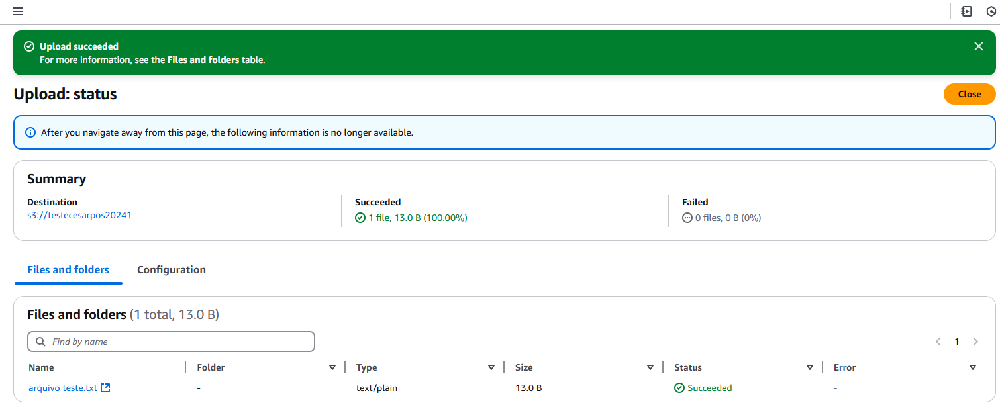

### 3. Acessar Objeto Criado

3.1. Na próxima tela, é possível ver o arquivo já disponível no bucket criado. Clique no objeto.

3.2. Nessa tela, é possível ver as informações referentes ao objeto e a URL para acesso público. Copie a URl e cole no navegador e para tentar acessar o objeto.

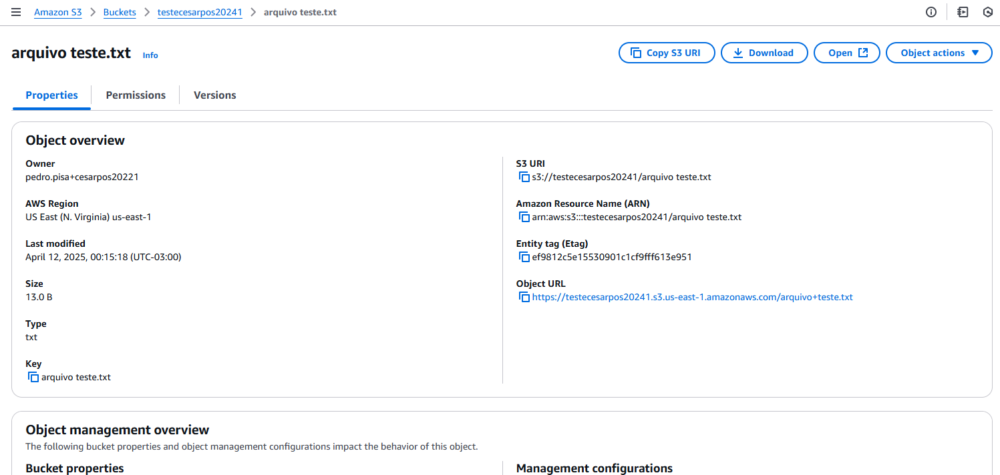

3.3. Esse é o resultado de uma consulta a URL de um objeto privado no bucket do S3. Você vai observar que ele não pode ser acessado. Para esse lab, vamos deixa o acesso público para testes e facilitar a visualização das mudanças dos arquivos. Em ambiente com dados reais, sempre pense duas vezes antes de deixar um objetivo público.

3.4. Para permitir o acesso público a objetos, você pode ir no menu **Object actions** e escolher a opção **Make public using ACL**. No entanto, para o nosso objeto, essa opção estará desabilitada.

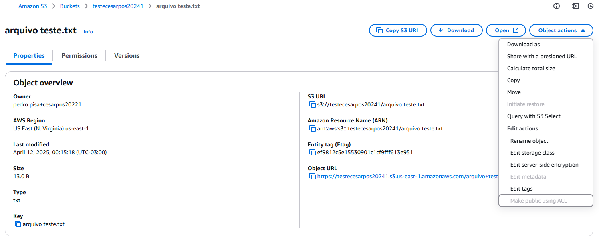

3.5. Isso ocorre, pois quando criamos o bucket deixamos um bloqueio no bucket para que nenhum objeto pudesse ser público e não habilitamos as ACLs. Será necessário mudar essas duas configurações. Volte na página do bucket e acesse o menu **Permissions**. Por padrão, o checkbox "Block all public access" está ativado. Edite e desative a opção. Por segurança, é necessário confirmar essa ação. Lembramos que, segundo as melhores práticas, todos os buckets devem ser privados e esse lab é apenas para fins didáticos.

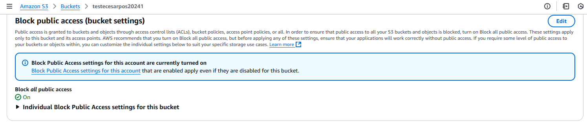

3.6. Além disso, precisamos ir na opção **Object Ownership**, nesta mesma página. Clicar em **edit** e ativar as **ACLs**.

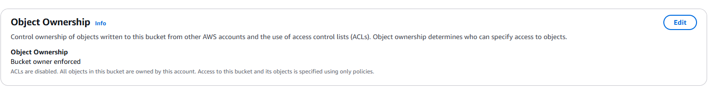

3.5. Após a confirmação, volte ao objeto, clique no menu **Object actions** e clique em **Make public with ACL**.

3.6. Copie e cole novamente a URL de acesso ao objeto no navegador. Como resultado você conseguirá visualizar o objeto.

