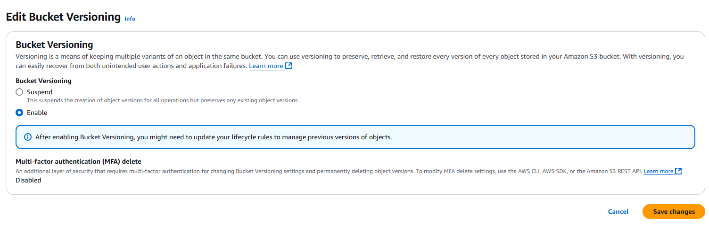
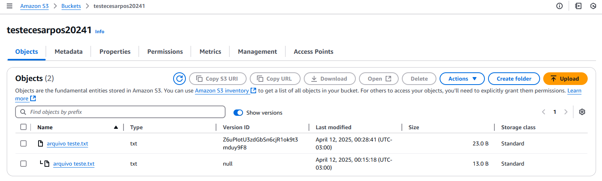

# Lab 04 - Versionamento no S3

1. Utilizando o bucket ja criado, vamos ativar o *versionamento*. Para isso, acesso o bucket e clique na aba **Properties**.

2. Vão aparecer algumas opções. Na seção **Bucket Versioning** e habilite essa opção conforme imagens a seguir.

3. Em seguida, volte na página inicial do bucket e faça o upload de um arquivo TXT com algum texto escrito. Siga o passo a passo para upload do arquivo, conforme feito no Lab 03.

4. Após o upload, volte na página do bucket e veja se o objeto já está disponível. Modifique a permissão e coloque o objeto público, como no Lab 03, e acesse sua URL. O conteúdo do objeto deve ser mostrado na página.

5. Em seguida, altere o conteúdo do arquivo TXT no seu computador e mantenha o mesmo nome. Faça o upload novamente, no mesmo bucket.

6. Após novo upload, clique no objeto e, na janela seguinte, ative a opção em **Show versions** e confirme se as duas versões do objeto estão disponíveis.

7. Copie e cole novamente a URL do objeto, ou simplesmente atualize a página que acessou o objeto antes. Como resultado, o conteúdo do objeto deve ser atualizado.

8. Na lista de objetos com as versões ativadas, clicando na versão desejada, é possível fazer o download de qualquer versão salva ou deletar qualquer versão.

